# Build Process

This document is the full, step-by-step record of how **The Nightmare** data warehouse was built in Power BI, from the first data import to the final row-level security rollout. It's organized into four phases, matching how the work actually progressed, and illustrated with screenshots taken directly from the Power Query editor and Model view.

Table and column names below reflect the actual, final model (verified against the source workbook and the Power Query editor) — a few names differ slightly from how they were first described during the build (e.g. the marketing source sheet is `CAMPAIGN_LOG`, not "Campaign Load"), and those are corrected here rather than repeated.

---

## Phase 1 — Data Import & Project Setup

**1. Importing the dataset**
The source data was imported from an Excel workbook (`dataset.xlsx`) into Power BI. The workbook contains one sheet per source table — customer, order, product, campaign, logistics, and finance data.

**2. Exploring the data**
Before any transformation work began, every table in the workbook was reviewed to understand its structure, columns, and quality.

**3. Organizing the project structure**
Four Power Query folders were created to keep the project maintainable as it grew: **01_stage**, **02_Dimensions**, **03_Facts**, and **04_Support**. All raw, imported tables live in staging; everything downstream is built as a *reference* from there, so the staging layer always remains the single source of truth.


Before any cleanup, simply loading every sheet and letting Power BI auto-detect relationships produced a tangle of duplicate-looking tables and guessed relationships — a useful reminder of why the staging/dimension/fact separation matters:

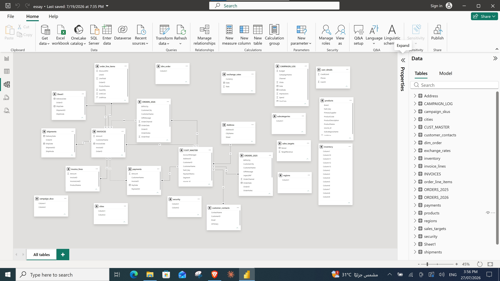

---

## Phase 2 — Building the Customer & Product Dimensions

**4. Creating the customer dimension**
A reference of the `CUST_MASTER` table was created, placed in the Dimensions folder, and renamed `DIM_Customer`.

**5. Preparing the customer table for merging**
Before merging the `customer_contacts` table into `DIM_Customer`, duplicate customer records were found in `customer_contacts`. Only rows where `IsPrimary = True` were kept, ensuring one row per customer before the merge.

**6. Adding user details**
The `user_details` table (credit limit, phone) was added to the data model.

**7. Standardizing the customer name**
One table referred to the entity as "Customer" and another as "Users" for the same underlying data. The naming used by the business department that consumes the report was adopted as the standard, to keep the model intuitive for its actual audience.

**8. Merging the address table**
The `Address` table was merged into `DIM_Customer`, and its first row was promoted to headers.

**9. Removing the Address–Cities relationship**
An existing relationship between the `Address` and `cities` tables was removed, since it wasn't part of the intended model design.

**10. Relating and merging Cities into DIM_Customer**
A relationship was created between `cities` and `DIM_Customer`, and the tables were then merged so city information became part of the customer dimension directly.

**11. Cleaning DIM_Customer**
The `AddressID`, `hash_key`, `source_id`, and `IsPrimary` columns were removed — none of them were needed in the final dimension.

**12. Renaming for consistency**
`DIM_Customer` was renamed to follow the project's `snake_case` naming convention: `dim_customer`.

**13. Hiding staging tables**
All staging tables consumed by dimension tables — including `regions` — were hidden from the report view, since they exist only to support the ETL process, not for direct reporting use.

**14. Removing auto-generated relationships**
After applying the Power Query changes, Power BI automatically created relationships involving the customer tables that weren't part of the intended model. These were removed to keep the relationship diagram clean and correct.

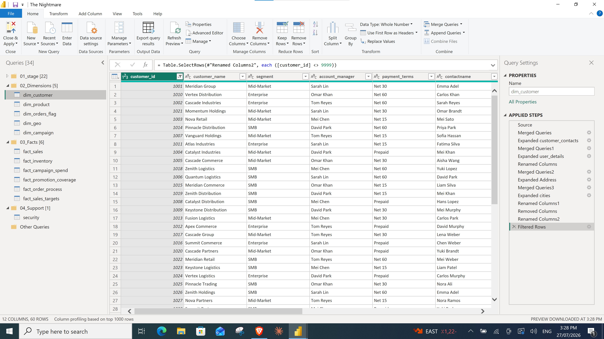

**15. Creating the product dimension**
A reference of the `products` table was created, moved to the Dimensions folder, and renamed `DIM_Product`.

**16. Checking for duplicate products**
The **Group By** feature in Power Query was used to check `DIM_Product` for duplicate product records.

**17. Preparing the subcategories table**
Before merging `subcategories` into `DIM_Product`, two issues were found: the table had no proper headers, and one column contained two values separated by a slash (`/`). The first row was promoted to headers, the combined column was split on the slash delimiter, and the resulting columns were renamed appropriately.

**18. Standardizing text casing before the merge**
Category names in `subcategories` were lowercase, while the corresponding values in `DIM_Product` were capitalized — a mismatch that would silently break the merge, since Power BI's merge matches on exact text. Every value in `subcategories` was converted to **Capitalize Each Word** format so the merge would match correctly.

**19. Adding a surrogate key**
An index column was added and renamed `product_key`, giving `DIM_Product` a proper surrogate key for use in the fact tables.

**20. Cleaning and renaming**
Unnecessary columns — `ProductDescription`, `hash_key`, and `source_id` — were removed, and the table was renamed to follow the `snake_case` convention: `dim_product`.

**21. Standardizing text formatting**
All text values in `dim_product` were converted to **Capitalize Each Word** format for consistent display in reports.

**22. Hiding staging tables**
The `products` and `subcategories` staging tables were hidden, since `dim_product` now supersedes them for reporting purposes.

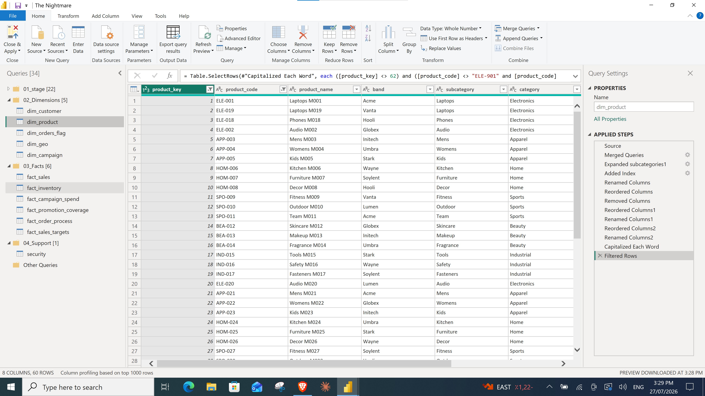

---

## Phase 3 — Building the Fact Tables & Star Schema

**23. Understanding the business requirements**
Before building any fact table, the underlying business events and operational documents were reviewed to understand the actual business process. This included comparing **OLTP** (transactional) vs. **OLAP** (analytical) design patterns to choose the appropriate data warehouse structure for reporting.

**24. Appending order tables**
The `ORDERS_2025` and `ORDERS_2026` tables were appended into a single, unified `orders` table.

**25. Cleaning and renaming orders**
The newly appended `orders` table was cleaned and kept in the staging folder, since it continues to feed multiple downstream dimensions and facts.

**26. Creating DIM_Order_Flags**
A reference of `orders` was created, moved to the Dimensions folder, and renamed `DIM_Order_Flags`. This dimension isolates descriptive order attributes — **channel**, **status**, and **priority** — away from the transactional fact data.

**27. Creating the order flag key**
An index column was added and renamed `flag_key`, and duplicate rows were removed so each unique combination of flags has a single key.

**28. Creating a channel lookup table**
A small `channels` table (channel code → channel name) was added to the model to resolve readable channel names — this one isn't part of the source workbook; it was entered directly as a short reference list.

**29. Resolving channel names**
`channels` was merged into `DIM_Order_Flags` to attach a readable `channel` name alongside the original `channel_code`.

**30. Creating FACT_Sales**
A reference of the `order_line_items` table was created, moved to the Facts folder, and renamed `FACT_Sales` — this is the core sales fact table, at order-line grain.

**31. Validating data consistency**
Before transforming `FACT_Sales`, the total `line_total` value was recorded as a baseline. After each subsequent transformation, the running total was compared back against this baseline to catch any unintended data loss or duplication early.

**32. Enriching FACT_Sales with keys**
`FACT_Sales` was merged with `orders` to pull in order-level details, then with `dim_customer` to attach the customer key, and finally with `dim_product` to attach the product key.

**33. Handling duplicate product matches**
After merging with `dim_product`, the `line_total` baseline no longer matched — some products shared the same name but had different product keys, causing one-to-many matches during the merge. This is a classic data-quality issue that, in a real project, would need to be raised with the business and data teams. For this project, rows where `product_key` came back null were removed to keep the fact table accurate.

**34. Investigating duplicate matches further**
The data was grouped by product name to identify exactly which products had multiple matches. After review, rows with a null `product_key` were removed to eliminate the duplicate mappings and restore a clean, one-to-one product relationship.

**35. Finalizing the fact table's columns**
`FACT_Sales` was merged with `DIM_Order_Flags` to attach the `flag_key`. Redundant columns — product name, order total, customer city, and region name — were then removed, since that information already lives in the corresponding dimension tables.

**36. Creating DIM_Geo**
A reference of the `cities` table was created, moved to the Dimensions folder, and renamed `DIM_Geo`.

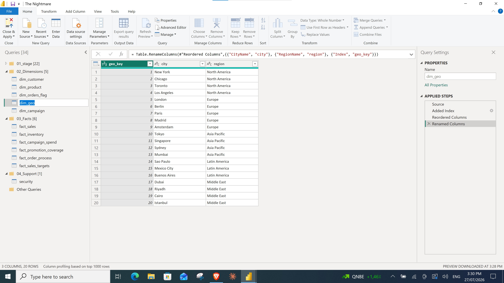

**37. Completing FACT_Sales as a role-playing dimension consumer**
`FACT_Sales` was merged with `DIM_Geo` **twice** — once to resolve the ship-to city and once for the bill-to city — retrieving a geographic key for each (`ship_to_city_key`, `bill_to_city_key`). This is a role-playing dimension pattern: one physical table (`dim_geo`) serving two different logical roles in the fact table. The original city name columns were removed, and the table was renamed to `fact_sales` (`snake_case`).

**38. Building the star schema relationships**
Relationships were created between the core dimension tables and `fact_sales`, completing the star schema for the sales business process. Because `dim_geo` relates to `fact_sales` twice, only the ship-to relationship is active by default; the bill-to relationship stays inactive and is invoked with `USERELATIONSHIP()` when needed.

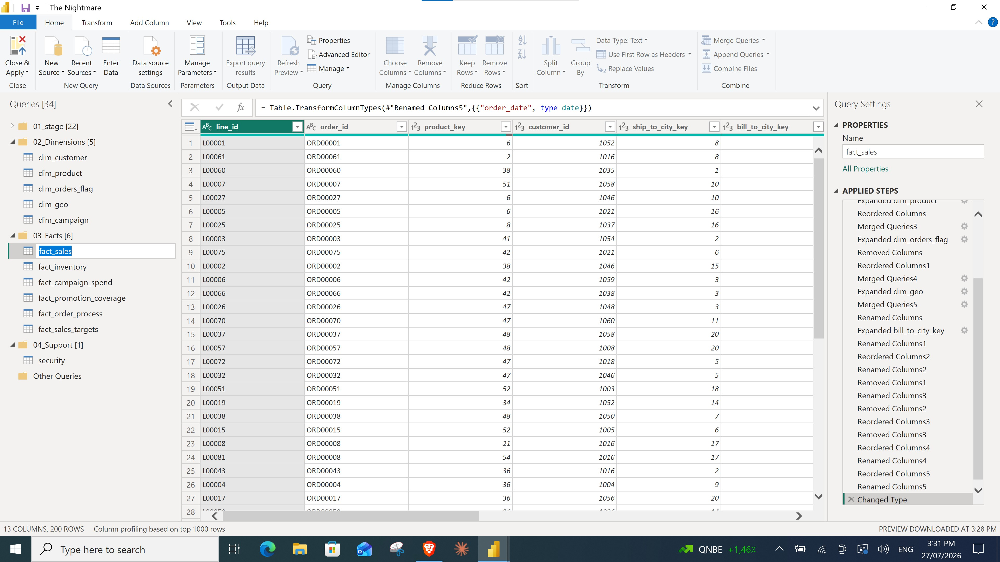

**39. Creating FACT_Inventory**
A reference of the `inventory` table was created, with its first row promoted to headers. The wide, per-month inventory columns were then unpivoted into a proper fact-table layout, merged with `dim_product` to retrieve the product key, and the redundant product name column was dropped in favor of the key. The table was renamed `fact_inventory`.

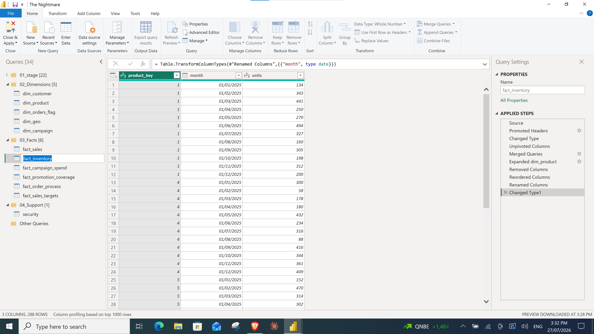

**40. Creating DIM_Campaign**
A reference of the `CAMPAIGN_LOG` table was created and renamed `DIM_Campaign`. Unnecessary columns and duplicate rows were removed, and an index column was added to serve as the `campaign_key`.

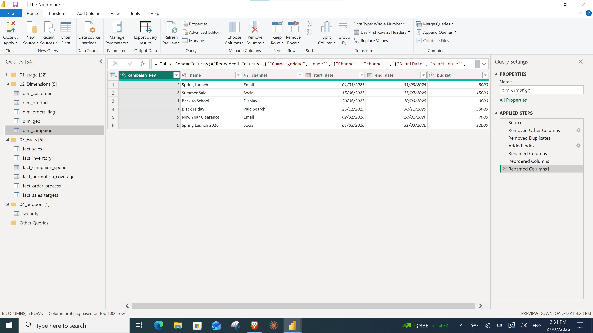

**41. Creating FACT_Campaign_Spend**
A second reference of `CAMPAIGN_LOG` — this time kept at its native daily grain — was created and renamed `FACT_Campaign_Spend`, merged with `DIM_Campaign` to attach the `campaign_key`, and trimmed down to `campaign_key`, `date`, `impressions`, `clicks`, and `spend`. This tracks day-by-day marketing performance independently of which products a campaign covered.

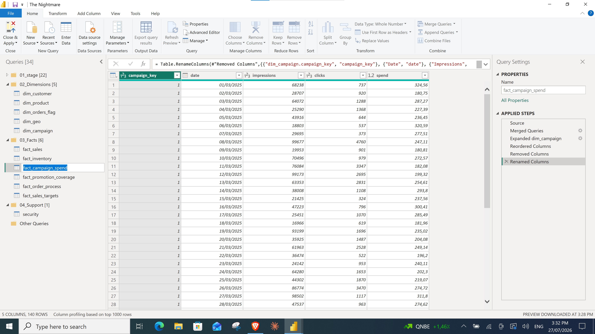

**42. Creating FACT_Promotion_Coverage**
A reference of the `campaign_skus` table was created. Since a single campaign record could apply to multiple products, its combined column was split into separate rows on its delimiter, then trimmed to remove extra whitespace and standardize the values.

**43. Enriching FACT_Promotion_Coverage**
The split rows were merged with `DIM_Campaign` to attach the `campaign_key`, and with `dim_product` to attach the `product_key`. All other intermediate columns were removed, leaving a clean two-column bridge table — `campaign_key` and `product_key` — that answers "which products did this campaign promote?"

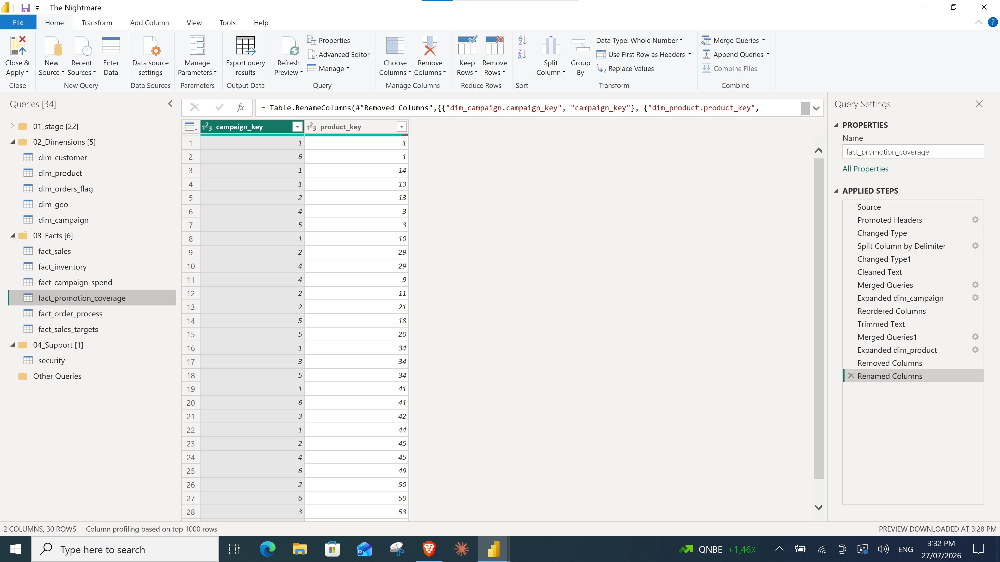

**44. Creating FACT_Order_Process**
A reference of `orders` was used to build out the order-fulfillment side of the model, tracking each order from placement through payment.

**45. Finalizing FACT_Order_Process**
The table was enriched by merging in `dim_customer` (for the customer key), `shipments` (ship date and delivery date), `INVOICES` (invoice date), and `payments` (payment date). A calculated `order_to_pay` column was then added to measure the duration between order and payment — this is the field behind the **Average Order to Pay** measure. Separately, load was disabled for the `exchange_rates` staging table, since currency conversion turned out not to be needed in the final model.

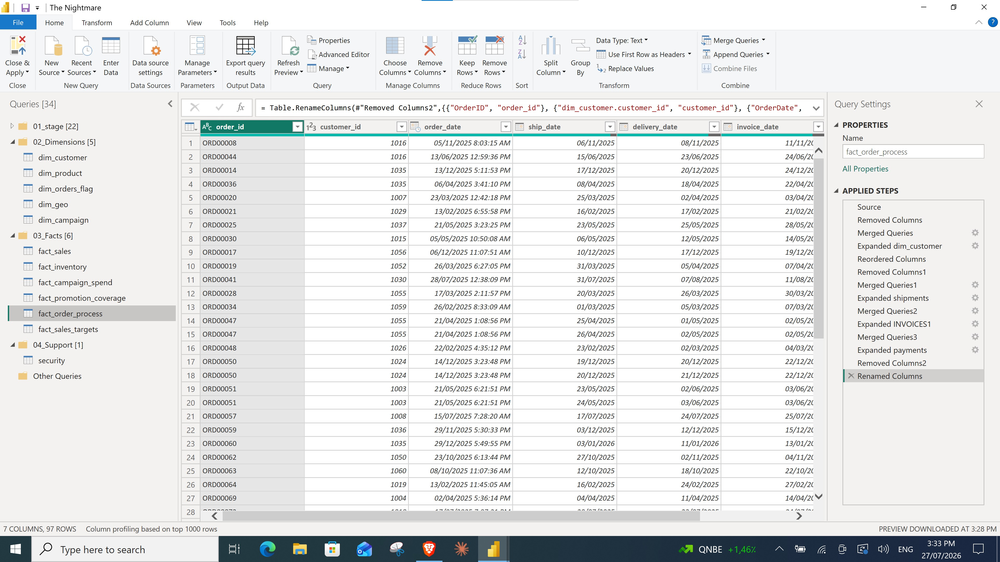

**46. Creating FACT_Sales_Targets**
`fact_sales_targets` was created from the `sales_targets` source table. The now-unused `dim_order` intermediate table was removed from the staging folder, since it had only served as a temporary helper during early data preparation.

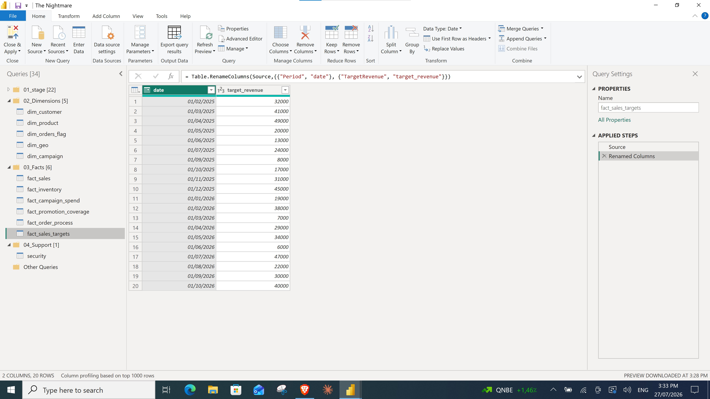

---

## Phase 4 — Polishing the Data Model

With all dimensions and facts in place, the final phase focused on getting the model ready for reporting and handover: validating modeling standards, connecting a proper date dimension, centralizing business measures, securing the model, and verifying that numeric totals still reconciled.

**47. Standardizing date columns**
The format of every date column across the model was standardized for consistency.

**48. Creating DIM_Date**
A dedicated, calculated `dim_date` table (`Date`, `month`, `year`) was created and related to every fact table via its relevant date field, enabling consistent time intelligence across the whole model.

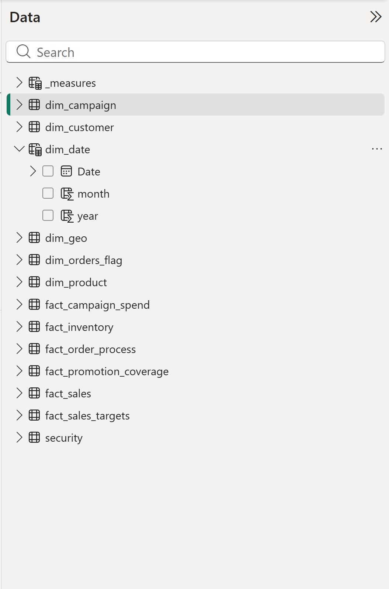

**49. Creating a dedicated measures table**
A standalone `_measures` table was added purely to house DAX measures, keeping them organized and separate from data tables.

**50. Creating the core business measures**
The following measures were written to answer the model's key business questions: **Total Sales**, **Total Orders**, **Total Active Customers**, **Base Total Customers**, and **Average Order to Pay**. Full DAX definitions are documented in [`docs/dax-measures.md`](dax-measures.md).

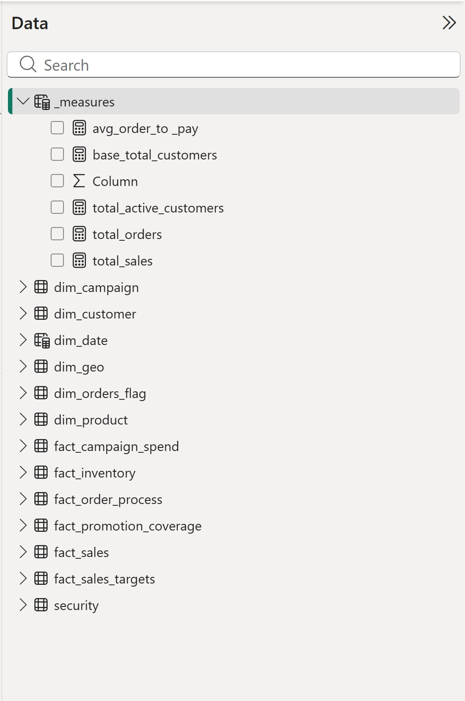

**51. Configuring row-level security**
A `security` table (`user_email`, `region`) was added and related to `dim_customer` to support row-level security (RLS).

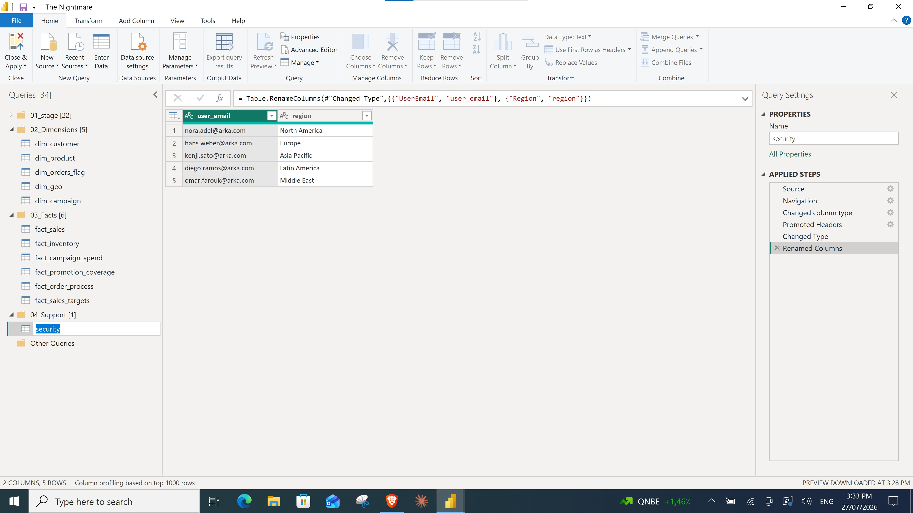

**52. Creating the RLS role**
A **Row-Level Security** role named `regional access` was created via **Manage security roles**, filtering `dim_customer` so that:

```dax
[region_name] = LOOKUPVALUE(security[region], security[user_email], USERPRINCIPALNAME())
```

This ensures each user can only see data for the region they're assigned to in the `security` table. The role was validated by viewing the report as `nora.adel@arka.com`, who is assigned to North America.

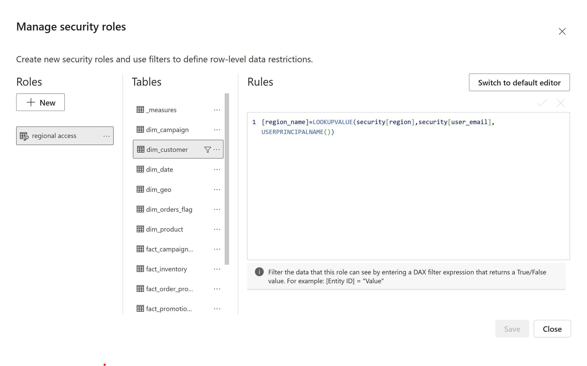

---

The result is the star schema documented in full in [`docs/data-model.md`](data-model.md):

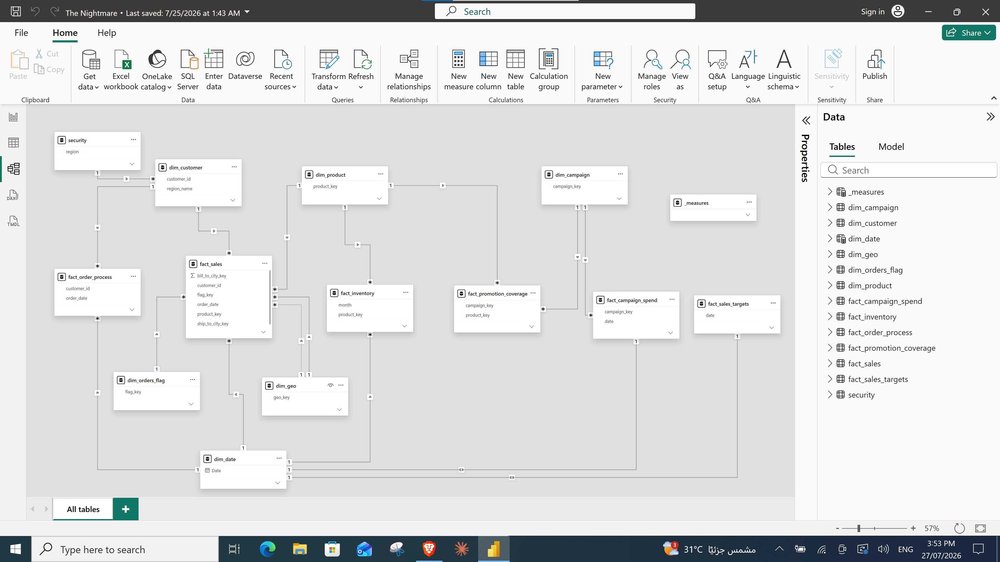
