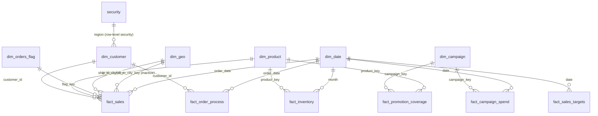

# Data Model

The Nightmare uses a **Kimball-style star schema**: dimension tables describe *who*, *what*, and *where*, while fact tables hold the measurable events tied to those dimensions. The model covers four business processes — sales, inventory, marketing, and order fulfillment — sharing a common set of conformed dimensions.

## Before & After

Early in the build, every source sheet was loaded and related as-is — duplicate-looking tables, no clear hierarchy, relationships Power BI had guessed on its own:

After staging, cleaning, and modeling, the same data resolves into a clean star schema:

## Entity-Relationship Diagram

> `dim_geo` is a **role-playing dimension**: it relates to `fact_sales` twice — once for `ship_to_city_key`, once for `bill_to_city_key` — rather than being duplicated as two physical tables. Only one of the two relationships can be active at a time in Power BI; the inactive one is invoked with `USERELATIONSHIP()` in DAX when a measure needs to analyze by billing city instead of shipping city.

## Dimension Tables

### `dim_customer` — 12 columns, 60 rows
One row per customer, consolidated from customer master data, contact details, user records, and address/city information.

| Column | Notes |
|---|---|
| `customer_id` | Surrogate/business key |
| `customer_name` | |
| `segment` | Enterprise / Mid-Market / SMB |
| `account_manager` | |
| `payment_terms` | Net 15 / Net 30 / Net 60 / Prepaid |
| `contactname` | Primary contact, from customer contacts |
| `email` | |
| `phone` | |
| `credit_limit` | |
| `city_name` | |
| `region_name` | Used by the row-level security filter |
| `street` | |

### `dim_product` — 8 columns, 60 rows
One row per product, with standardized category/subcategory names.

| Column | Notes |
|---|---|
| `product_key` | Surrogate key (index column) |
| `product_code` | Business key, e.g. `ELE-001` |
| `product_name` | |
| `band` | Supplier/brand label |
| `category` | e.g. Electronics, Apparel, Home, Sports, Beauty, Industrial |
| `subcategory` | e.g. Laptops, Kitchen, Skincare |
| `primary_supplier` | |
| `unit_price` | |

### `dim_orders_flag` — 5 columns, 14 rows
One row per unique combination of channel, status, and priority.

| Column | Notes |
|---|---|
| `flag_key` | Surrogate key |
| `channel_code` | |
| `channel` | Online Store, Retail Partner, Wholesale, Field Sale |
| `Status` | Processing, Shipped, Delivered |
| `Priority` | Standard, Express |

### `dim_geo` — 3 columns, 20 rows
One row per city, spanning five regions (North America, Europe, Asia Pacific, Latin America, Middle East).

| Column | Notes |
|---|---|
| `geo_key` | Surrogate key |
| `city` | |
| `region` | |

### `dim_campaign` — 6 columns, 6 rows
One row per marketing campaign.

| Column | Notes |
|---|---|
| `campaign_key` | Surrogate key |
| `name` | e.g. Spring Launch, Black Friday |
| `channel` | Email, Social, Display, Paid Search |
| `start_date` | |
| `end_date` | |
| `budget` | |

### `dim_date`
Standard calculated date table, related to every fact table via its date column.

| Column | Notes |
|---|---|
| `Date` | |
| `month` | |
| `year` | |

## Fact Tables

### `fact_sales` — 13 columns, 200 rows
**Grain: one row per order line item.** The core sales fact table.

| Column | Notes |
|---|---|
| `line_id` | |
| `order_id` | |
| `product_key` | FK → `dim_product` |
| `customer_id` | FK → `dim_customer` |
| `ship_to_city_key` | FK → `dim_geo` |
| `bill_to_city_key` | FK → `dim_geo` (inactive relationship) |
| `flag_key` | FK → `dim_orders_flag` |
| `order_date` | FK → `dim_date` |
| `line_total` | |
| `price` | |
| `quantity` | |
| `cost` | |
| `discount` | |

### `fact_inventory` — 3 columns, 288 rows
**Grain: one row per product per month.** Built by unpivoting a wide, per-month inventory layout.

| Column | Notes |
|---|---|
| `product_key` | FK → `dim_product` |
| `month` | FK → `dim_date` |
| `units` | |

### `fact_campaign_spend` — 5 columns, 140 rows
**Grain: one row per campaign per day.** Marketing performance metrics.

| Column | Notes |
|---|---|
| `campaign_key` | FK → `dim_campaign` |
| `date` | FK → `dim_date` |
| `impressions` | |
| `clicks` | |
| `spend` | |

### `fact_promotion_coverage` — 2 columns, 30 rows
**Grain: one row per campaign–product pairing.** A pure bridge table with no measures of its own — it answers "which products did this campaign promote?"

| Column | Notes |
|---|---|
| `campaign_key` | FK → `dim_campaign` |
| `product_key` | FK → `dim_product` |

### `fact_order_process` — 7 columns, 97 rows
**Grain: one row per order.** Tracks the order lifecycle from placement to payment.

| Column | Notes |
|---|---|
| `order_id` | |
| `customer_id` | FK → `dim_customer` |
| `order_date` | FK → `dim_date` |
| `ship_date` | |
| `delivery_date` | |
| `invoice_date` | |
| `pay_date` | |
| `order_to_pay` | Calculated duration between order and payment; feeds the **Average Order to Pay** measure |

### `fact_sales_targets` — 2 columns, 20 rows
**Grain: one row per month.**

| Column | Notes |
|---|---|
| `date` | FK → `dim_date` |
| `target_revenue` | |

## Support Table

### `security` — 2 columns, 5 rows
Maps each report user to the region they're allowed to see. Used by the row-level security role — see [Row-Level Security](../README.md#row-level-security).

| Column | Notes |
|---|---|
| `user_email` | |
| `region` | |

## Naming Conventions

- All finalized dimension and fact tables use `snake_case` naming (e.g. `dim_customer`, `fact_sales`).
- Dimension tables are prefixed `dim_`; fact tables are prefixed `fact_`.
- Raw, imported tables remain untouched in the **01_stage** query folder and are hidden from report view once their data has been absorbed into a dimension or fact table.

## Power Query Folder Organization

Queries are organized into four folders to separate raw data from the reporting-ready model:

| Folder | Contents |
|---|---|
| `01_stage` | Raw, imported source tables (22 queries) |
| `02_Dimensions` | Finalized dimension tables (`dim_customer`, `dim_product`, `dim_orders_flag`, `dim_geo`, `dim_campaign`; `dim_date` was added later as a calculated table) |
| `03_Facts` | Finalized fact tables (`fact_sales`, `fact_inventory`, `fact_campaign_spend`, `fact_promotion_coverage`, `fact_order_process`, `fact_sales_targets`) |
| `04_Support` | Supporting tables not part of the star schema (`security`) |

## Row-Level Security

The `security` table (`user_email` → `region`) backs a region-based RLS role. See [`docs/dax-measures.md`](dax-measures.md) and the [Row-Level Security](../README.md#row-level-security) section of the README for the exact filter logic.
